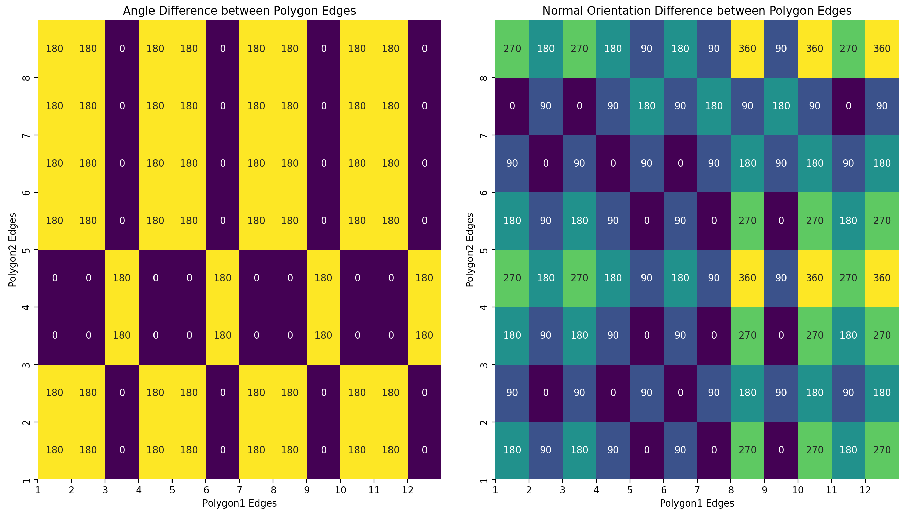

# Shape Docking

## Problem Statement

The challenge is to determine how two distinct polygons can align without overlap. This involves understanding their internal structures, their orientations, and then making informed decisions about their spatial configuration.

While several configurations are possible, this project aims to find the most harmonious juxtapositions of the two polygons.

## Solution Strategy

### 1. **Histogram Analysis**:

- **Internal Angles**: The first step is to calculate a histogram for the internal angles of both polygons. This helps understand the inherent structure and orientation of the polygons.

- **Normals**: The next step is to create a histogram for the normals with respect to the edges of each polygon, oriented towards an absolute reference frame (0° pointing to the right, 90° pointing upwards, -90° pointing downwards, etc.). This offers a clear representation of the directional attributes of each polygon's edges.

### 2. **Heatmap Creation**:

By calculating the difference between the two histograms of the polygons, two distinct heatmaps are created:

- One for the internal angles
- One for the normals

These heatmaps visualize the potential differences and similarities between the two polygons and their possible alignments.

### 3. **Identifying Minima**:

Using `skimage`, minima points are identified on the heatmap. These points signify potential areas where the two polygons can align closely, minimizing their differences.

### 4. **Rotation and Alignment**:

For each minima detected:

- The rotation required to align the two polygons is calculated from the normals' histogram.
  
- The second polygon is then rotated counter-clockwise by the determined angle.

- Once rotated, the polygons are then moved such that the midpoints of their corresponding edges are as close as possible.

## Conclusion

This project provides an innovative method to align two distinct polygons using histogram analysis, heatmap generation, and computational geometry. By integrating multiple techniques, it becomes possible to not just find all feasible configurations, but to discern which of these is the most harmonious.

## Future Work

- **Polygon Generation**: The current implementation of the project uses a fixed set of polygons. In the future, it would be interesting to generate random polygons and test the algorithm on them.

## References

- [A Polygon and Point-Based Approach to Matching Geospatial Features](https://www.mdpi.com/2220-9964/6/12/399)

## Author

- [Marco Perini](https://www.linkedin.com/in/perinim/) - MSc in Mechatronics Engineering, University of Trento

## License

This project is licensed under the MIT License - see the [LICENSE](LICENSE) file for details